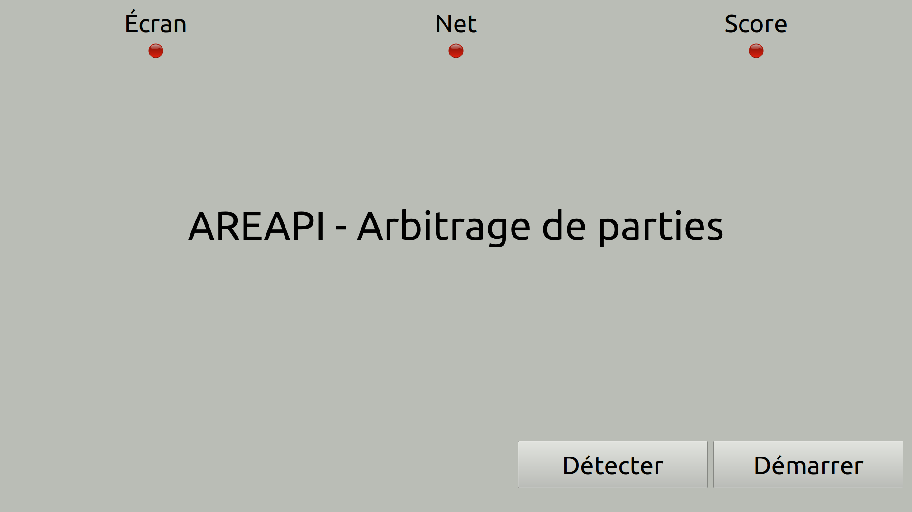
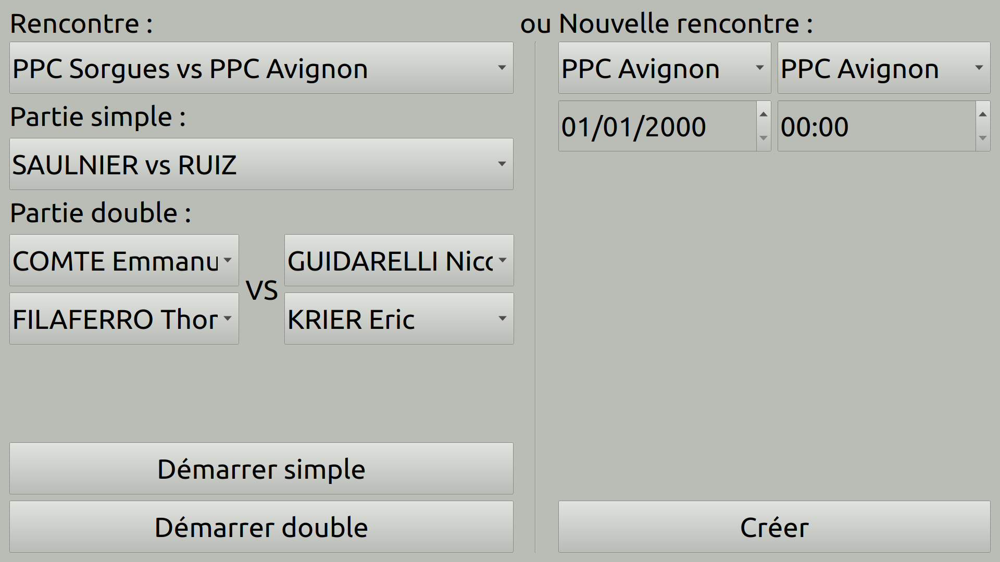
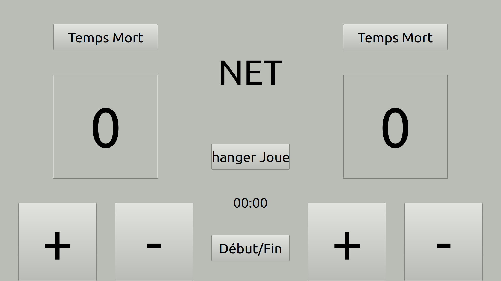

# Projet AREAPI 2022

Système d’assistance à l’arbitrage lors d’une partie de tennis de table en compétition.

- Module de gestion de partie (**Arbitre-AREA IR**) ​: l’arbitre gère le score de la partie à partir d’une application sur un écran tactile
- Module de détection de “net” (Net-AREA EC) : le module détecte la validité d’un “net” de la balle lors d’un service et le signale
- Module d'affichage de score (Score-AREA EC) : les joueurs, les arbitres et le public peuvent visualiser en “temps réel” le score d’une partie
- Module d'affichage de la partie (**Afficheur-AREA IR**) ​: les joueurs, les arbitres et le public peuvent visualiser en “temps réel” le déroulement des parties sur un écran de télévision

## Historique des versions

- Version 0.2 : 24/05/2022
- Version 0.1 : 02/04/2022

## Auteurs

- Arbitre-AREA : Mathéo Bert <<bert.matheo2521@gmail.com>>
- Afficheur-AREA : Enzo Ladriere <<enzo.ladriere.pro@gmail.com>>

## Kanban

[areapi-2022](https://github.com/btssn-lasalle-84/areapi-2022/projects/1)

## Documentation du code

https://btssn-lasalle-84.github.io/areapi-2022/

## Base de données

## Module de gestion de partie Arbitre-AREA

